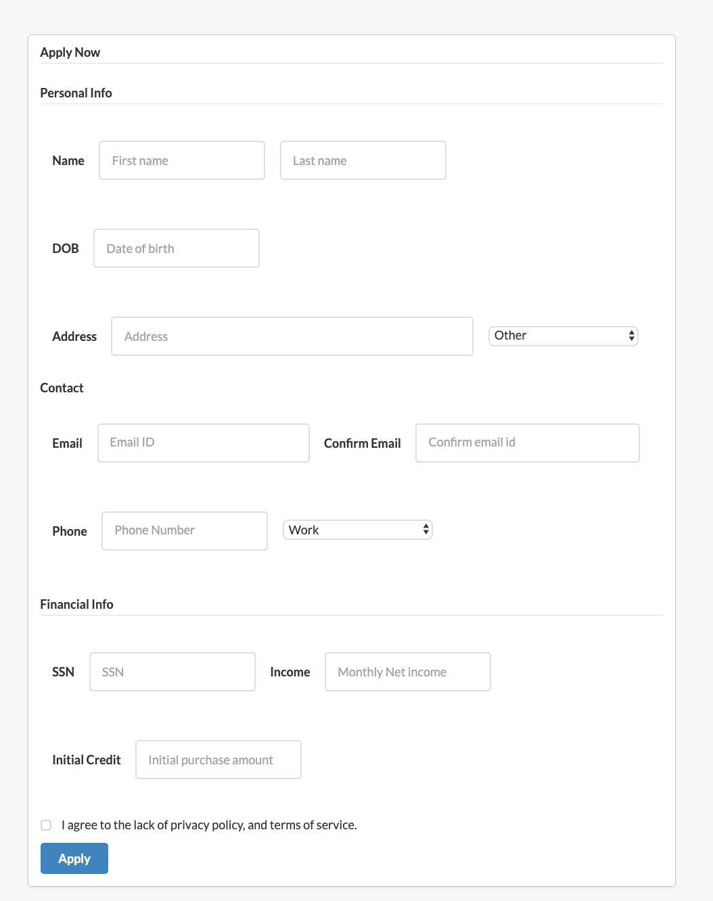
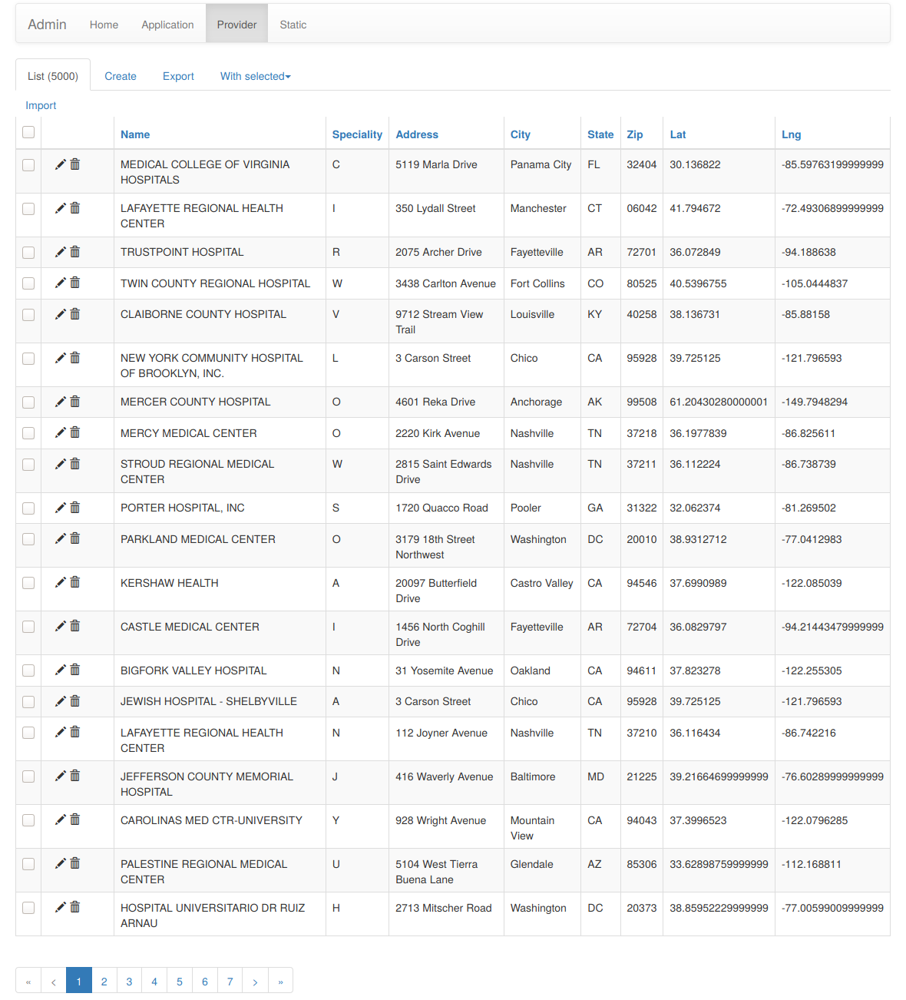

# Healthcare Credit Provider


Add one line description

Add Screechots

<p align="center">
	
	
	
	
</p>

Add description

## Features

- [x] User account sign up, sign in, password reset, all through asynchronous
      email confirmation.
- [x] Form generation.
- [x] Error handling.
- [x] HTML macros and layout file.
- [x] "Functional" file structure.
- [x] Python 3.x compliant.
- [x] Asynchronous AJAX calls.
- [ ] Application factory.
- [x] Administration panel.
- [ ] Static file bundling, automatic SCSS to CSS conversion and automatic
      minifying.
- [ ] Websockets (for example for live chatting)
- [x] Virtual environment example.
- [x] Digital Ocean deployment example.
- [ ] Tests.
- [x] Logging.
- [ ] Language selection.
- [ ] Automatic API views.
- [ ] API key generator.

If you have any suggestions or want to help, feel free to drop me a line at
<maxhalford25@gmail.com> or to create an issue.

## Libraries

### Backend

- [Flask](http://flask.pocoo.org/), obviously.
- [Flask-Login](https://flask-login.readthedocs.org/en/latest/) for the user
  accounts.
- [Flask-SQLAlchemy](https://pythonhosted.org/Flask-SQLAlchemy/) interacting
  with the database.
- [Flask-WTF](https://flask-wtf.readthedocs.org/en/latest/) and
  [WTForms](https://wtforms.readthedocs.org/en/latest/) for the form handling.
- [Flask-Mail](https://pythonhosted.org/Flask-Mail/) for sending mails.
- [itsdangerous](http://pythonhosted.org/itsdangerous/) for generating random
  tokens for the confirmation emails.
- [Flask-Bcrypt](https://flask-bcrypt.readthedocs.org/en/latest/) for generating
  secret user passwords.
- [Flask-Admin](https://flask-admin.readthedocs.org/en/latest/) for building an
  administration interface.
- [Flask-Script](https://flask-script.readthedocs.io/en/latest/) for managing
  the app.
- [structlog](http://structlog.readthedocs.io/en/stable/) for logging.
- [Flask-DebugToolBar](https://flask-debugtoolbar.readthedocs.io/en/latest/) for
  adding a performance toolbar in development.
- [gunicorn](http://gunicorn.org/) for acting as a reverse-proxy for Nginx.

### Frontend

- [Semantic UI](http://semantic-ui.com/) for the global style.
- [Google Maps](https://cloud.google.com/maps-platform/) for the map.

### Test automation

Add details

## Structure

I did what most people recommend for the application's structure. Basically,
everything is contained in the `app/` folder.

- There you have the classic `static/` and `templates/` folders. The
  `templates/` folder contains macros, error views and a common layout.
- I added a `views/` folder to separate the user and the website logic, which
  could be extended to the the admin views.
- The same goes for the `forms/` folder, as the project grows it will be useful
  to split the WTForms code into separate files.
- The `models.py` script contains the SQLAlchemy code, for the while it only
  contains the logic for a `users` table.
- The `toolbox/` folder is a personal choice, in it I keep all the other code
  the application will need.
- Management commands should be included in `manage.py`. Enter
  `python manage.py -?` to get a list of existing commands.
- I added a Makefile for setup tasks, it can be quite useful once a project
  grows.

## Setup

### Vanilla

- Install the requirements and setup the development environment.

	```shell script
	make install 
	make dev
	```

- Create the database.

	```shell script
	env GOOGLE_MAPS_API_KEY=key HCP_ADMIN=admin_name HCP_PASS=admin_pass \
	python manage.py initdb
	```

- Run the application.

	```shell script
    env HCP_ADMIN=admin_name HCP_PASS=admin_pass \
    GOOGLE_MAPS_API_KEY=maps-api-key GOOGLE_API_KEY=geocoding-api-key \
    GOOGLE_APPLICATION_CREDENTIALS=google-client-credential-filepath.json \
    python manage.py runserver
    ```

- Navigate to `localhost:5000`.

<!-- Currently Unsupported (figure out how to configure venv to autoload env)
### Virtual environment

```shell script
pip install virtualenv
virtualenv venv
venv/bin/activate (venv\scripts\activate on Windows)
make install
make dev
python manage.py initdb
python manage.py runserver
```
-->

<!-- Currently Unsupported (figure out how to pass env variables to docker @ runtime)
## Deployment

The current application can be deployed with Docker [in a few commands](https://realpython.com/blog/python/dockerizing-flask-with-compose-and-machine-from-localhost-to-the-cloud/).

```shell script
cd ~/path/to/application/
docker-machine create -d virtualbox --virtualbox-memory 512 --virtualbox-cpu-count 1 dev
docker-machine env dev
eval "$(docker-machine env dev)"
docker-compose build
docker-compose up -d
docker-compose run web make dev
docker-compose run web python3 manage.py initdb
```

Then access the IP address given by `docker-machine ip dev` et voilà. This is exactly how [OpenBikes's API is being deployed](https://github.com/OpenBikes/api.openbikes.co).
-->

## Configuration

The goal is to keep most of the application's configuration in a single file
called `config.py`. I added a `config_dev.py` and a `config_prod.py` who inherit
from `config_common.py`. The trick is to symlink either of these to `config.py`.
This is done in by running `make dev` or `make prod`.

I have included a working Gmail account to confirm user email addresses and
reset user passwords, although in production you should't include the file if
you push to GitHub because people can see it. The same goes for API keys, you
should keep them secret. You can read more about secret configuration files
[here](https://exploreflask.com/configuration.html).

Read [this](http://flask.pocoo.org/docs/0.10/config/) for information on the
possible configuration options.

## Project based on:

- [flask-boilerplate](https://github.com/MaxHalford/flask-boilerplate) fork
  maintained by [Harsh Parekh](https://github.com/hXtreme) at
  [hXtreme/flask-boilerplate](https://github.com/hXtreme/flask-boilerplate).

## License

The MIT License (MIT). Please see the [license file](LICENSE) for more
information.
